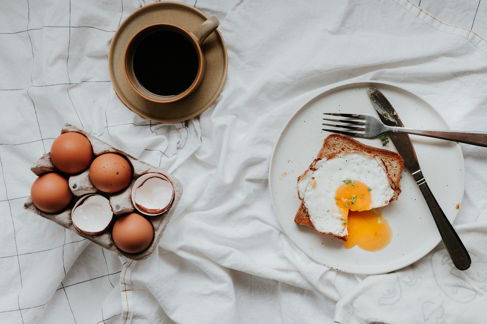

<html>

  <body>
    
    <h3>by Katelyn Fong | 09/22/2023</h3>
    <h3>by Katelyn Fong | 09/22/2023</h3>
    <h1>Day in the life of an average teenager!</h1>
    <h2>Morning routine</h2>
    
    

      First, I wake up at bright and early at 6:30 AM to get ready for school. I always eats eggs and toast for breakfast, then brush teeth, then put on school-appropriate clothes, then brush my hair, and lastly put on shoes, in that particular order. It is an efficient routine that guarantees my arrival at school by 7:20 AM each day, with enough time to go to my locker and get to my zero period, Computer Science Principles, on time.
    

    <h2>School day</h2>
    
    

      I have what I like to call five <em>real</em> classes. My schedule goes: CompSci, Stats, Chem, Chinese, English, T.A., and athletics. To reduce my workload after school, I try to complete as much homework as I can in class. For me, the most enjoyable time of the day is lunch, where I get to spend time talking with my friends about my favorite online game. As the day goes on, I feel appreciative for my T.A. period where I can relax and alphabetize. Finally, I go to off-season waterpolo practice at CPE.
    

    <h2>Swim practice</h2>
    
    

      After water-polo practice, I head home and chill a bit until I head back to CPE for Cerritos Aquatics swim practice from 5PM to 7PM. It's plenty of good exercise and helps me stay fit. 
    

    <h2>Nighttime routine</h2>
    
After swim practice, I eat dinner (my favorite dinner is this yummy recipe for <a href="https://cooking.nytimes.com/recipes/12177-fried-rice" target="_blank">fried rice</a>) and take a quick shower. Then I complete all my homework and try to get head to bead shortly after 10 PM.
    

     
    

    Thank you for reading! Hope you enjoyed :)
    

    <h4>A little bit about me!</h4>
    <ul>
      <li>Nationality: Chinese and Vietnamese</li>
      <li>Grade: Sophomore</li>
      <li>Favorite color: Matcha green</li>
      <li>Favorite music artist: Taylor Swift</li>
      <li>Fun fact about me: I know a bit of sign language!</li>
    </ul>
  </body>
</html>
